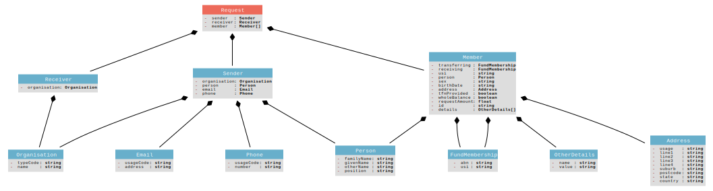

# rollover

## Request

#### sender: [Sender](#sender)

#### receiver: [Receiver](#receiver)

#### member: [Member](#member)[]

## Receiver

#### organisation: [Organisation](#organisation)

## Member

#### transferring: [FundMembership](#transferring)

#### receiving: [FundMembership](#receiving)

#### usi ([Unique Superannuation Identifier](http://super.shuck.io/define/de1)): string

The unique superannuation identifier is used for identifying the product within the fund which the member account belongs to.

#### person: [Person](#person)

#### sex ([Person Sex Code](http://super.shuck.io/define/de2)): string

A code indicating the biological distinction between male and female as reported by a person or as determined by an interviewer.

#### birthDate ([Person Demographic Details Birth Date](http://definitions.ausdx.io/definition/trc/de36)): string

The year, month and day in which an individual was born.

#### address: [Address](#address)

#### tfnProvided ([Identifiers Tax File Number Not Provided Indicator](http://definitions.ausdx.io/definition/ss/de12710)): boolean

Indicates that the Tax File Number has not been provided.

#### wholeBalance ([Superannuation Rollover Transfer Whole Balance Indicator](http://definitions.ausdx.io/definition/ss/de12700)): boolean

Indicates if entire balance of the member's contributions with the transferring fund is to be rolled over to the receiving fund.

#### requestAmount ([Superannuation Rollover Requested Amount](http://definitions.ausdx.io/definition/ss/de12701)): float

The rollover amount that the member is requesting the transferring fund to transfer to the nominated receiving fund.

#### id ([Superannuation Fund Details Member Client Identifier](http://definitions.ausdx.io/definition/ss/de7396)): string

This is the superannuation member's client ID which assists to uniquely identify the member for the provider.

#### details: [OtherDetails](#details)[]

Not to be used unless the legislation specifies how

## FundMembership

#### abn ([Identifiers Australian Business Number Identifier](http://definitions.ausdx.io/definition/trc/de26)): string

A unique public identifier issued to all entities registered in the Australian Business Register (ABR), to be used in their dealings with government. Companies registered under the Corporations Law and business entities carrying on an enterprise in Australia are entitled to an ABN.

#### usi ([Superannuation Fund Details Unique Superannuation Identifier](http://definitions.ausdx.io/definition/trc/de7395)): string

The unique superannuation identifier is used for identifying the product within the fund which the member account belongs to.

## OtherDetails

Name and Value pair for any potential future needs

#### name: string

#### value: string

## Sender

#### organisation: [Organisation](#organisation)

#### person: [Person](#person)

#### email: [Email](#email)

#### phone: [Phone](#phone)

## Address

#### usage ([Address Details Usage Code](http://definitions.ausdx.io/definition/trc/de23)): string

Implements one of the possible address types available for a Party.  Many businesses have multiple addresses that include locations, mailing addresses, corporate offices and seasonal addresses.  For individual clients, examples includes Residential, Postal or Registered address.

RES - Residential, TEM - Temporary accommodation, BUS - Business, DEL - Delivery address, POS - Postal or correspondence address, CNT - General contact, including when using a 3rd party as contact, PMT - Address to be used for payment purposes

#### line1 ([Address Details Line 1 Text](http://definitions.ausdx.io/definition/trc/de17)): string

First line utilising free format, that is used to create a semi structured address.

#### line2 ([Address Details Line 2 Text](http://definitions.ausdx.io/definition/trc/de18)): string

Second line utilising free format, that is used to create a semi structured address.

#### line3 ([Address Details Line 3 Text](http://definitions.ausdx.io/definition/trc/de167)): string

The content of an address line used for overseas addresses. This can also be used for Australian addresses that do not conform with the structured address format.

Unstructured addresses have many formats. To accommodate this the use of
unstructured lines of detail are used. While 4 lines have been provided for overseas
address details, not all lines need to be used.
Overseas addresses may follow different formats to that of Australian addresses. So they required an unstructured format to support their peculiarities.
Common differences are:
- Street name preceding street number
- Postcode format
- Postcode preceding locality name

#### line4 ([Address Details Line 4 Text](http://definitions.ausdx.io/definition/trc/de80)): string

The content of an address line used for overseas addresses. This can also be used for Australian addresses that do not conform with the structured address format.

Unstructured addresses have many formats. To accommodate this the use of
unstructured lines of detail are used. While 4 lines have been provided for overseas
address details, not all lines need to be used.
Overseas addresses may follow different formats to that of Australian addresses. So they required an unstructured format to support their peculiarities.
Common differences are:
- Street name preceding street number
- Postcode format
- Postcode preceding locality name

#### suburb ([Address Details Locality Name Text](http://definitions.ausdx.io/definition/trc/de19)): string

A word or combination of words, by which a geographic locality/suburb is designated or known.

#### postcode ([Address Details Postcode Text](http://definitions.ausdx.io/definition/trc/de21)): string

The Australian descriptor for a postal delivery area, aligned with locality, suburb or place

#### state ([Address Details State Or Territory Code](http://definitions.ausdx.io/definition/trc/de22)): string

The code that is assigned to each Australian State or Territory

#### country ([Address Details Country Name Text](http://definitions.ausdx.io/definition/trc/de528)): string

This represents the Country Name as prescribed by AS4590 and inherited from ISO 3166

## Organisation

#### typeCode ([Organisation Name Details Organisational Name Type Code](http://definitions.ausdx.io/definition/trc/de64)): string

A code that represents what type of name is reported.

MN - Main or legal name, MTR - Main trading name, OTR - Other trading name, OTH - Other name, MAU - Management accounting unit, UNK - Unknown

#### name ([Organisation Name Details Organisational Name Text](http://definitions.ausdx.io/definition/trc/de55)): string

The full name by which an organisation is known.

## Person

#### familyName ([Person Name Details Family Name Text](http://definitions.ausdx.io/definition/trc/de40)): string

The person's last name or surname. The name by which a family group is identified.

#### givenName ([Person Name Details Given Name Text](http://definitions.ausdx.io/definition/trc/de41)): string

The name given to a person which is that person's identifying name within the family group or the name by which the person is uniquely socially identified; the name borne by an individual, often assigned by his or her parents shortly after birth, as opposed to the inherited surname.

#### otherName ([Person Name Details Other Given Name Text](http://definitions.ausdx.io/definition/trc/de42)): string

The middle name given to a person which complements that person's identifying name within the family group or the name by which the person is uniquely socially identified.

#### position ([Person Name Details Position Text](http://definitions.ausdx.io/definition/trc/de1601)): string

This is the employment position title of an individual.

## Email

#### usageCode ([Electronic Contact Electronic Mail Usage Code](http://definitions.ausdx.io/definition/trc/de93)): string

The code that determines the primary use of the electronic mail address

01 - Personal, 02 - Business, 03 - Contact, 08 - Other, 09 - Unknown

#### address ([Electronic Contact Electronic Mail Address Text](http://definitions.ausdx.io/definition/trc/de6)): string

Denotes the address of an electronic mail service.

## Phone

#### usageCode ([Electronic Contact Telephone Usage Code](http://definitions.ausdx.io/definition/trc/de53)): string

The code that determines the primary use of the telephone.

01 - Personal: to be used when the telephone number is for non business affairs. It includes residential.
02 - Business: to be used when the telephone number is for business affairs
03 - Contact: to be used for general contact, including when using a 3rd party as contact
04 - Business After Hours: to be used when the telephone number is for business affairs outside of standard business hours
05 - Payment: to be used when the telephone number is for the purposes of making a payment
08 - Other: any other kind of usage
09 - Unknown: to be used when usage is not disclosed.

#### number ([Phone number](http://super.shuck.io/define/de3)): string

A number provided by a telephone service provider, used to uniquely identify a particular phone

