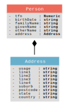

# tfn_integrity_check

## Person

#### tfn ([Tax file number](http://definitions.ausdx.io/definition/edu/edu416)): Numeric

The tax file number for a student

Field Name: TF-NUMBER

#### birthDate ([Person Demographic Details Birth Date](http://definitions.ausdx.io/definition/trc/de36)): string

The year, month and day in which an individual was born.

#### familyName ([Person Name Details Family Name Text](http://definitions.ausdx.io/definition/trc/de40)): string

The person's last name or surname. The name by which a family group is identified.

#### givenName ([Person Name Details Given Name Text](http://definitions.ausdx.io/definition/trc/de41)): string

The name given to a person which is that person's identifying name within the family group or the name by which the person is uniquely socially identified; the name borne by an individual, often assigned by his or her parents shortly after birth, as opposed to the inherited surname.

#### otherName ([Person Name Details Other Given Name Text](http://definitions.ausdx.io/definition/trc/de42)): string

The middle name given to a person which complements that person's identifying name within the family group or the name by which the person is uniquely socially identified.

#### address: [Address](#address)

## Address

#### usage ([Address Details Usage Code](http://definitions.ausdx.io/definition/trc/de23)): string

Implements one of the possible address types available for a Party.  Many businesses have multiple addresses that include locations, mailing addresses, corporate offices and seasonal addresses.  For individual clients, examples includes Residential, Postal or Registered address.

RES - Residential, TEM - Temporary accommodation, BUS - Business, DEL - Delivery address, POS - Postal or correspondence address, CNT - General contact, including when using a 3rd party as contact, PMT - Address to be used for payment purposes

#### line1 ([Address Details Line 1 Text](http://definitions.ausdx.io/definition/trc/de17)): string

First line utilising free format, that is used to create a semi structured address.

#### line2 ([Address Details Line 2 Text](http://definitions.ausdx.io/definition/trc/de18)): string

Second line utilising free format, that is used to create a semi structured address.

#### line3 ([Address Details Line 3 Text](http://definitions.ausdx.io/definition/trc/de167)): string

The content of an address line used for overseas addresses. This can also be used for Australian addresses that do not conform with the structured address format.

Unstructured addresses have many formats. To accommodate this the use of
unstructured lines of detail are used. While 4 lines have been provided for overseas
address details, not all lines need to be used.
Overseas addresses may follow different formats to that of Australian addresses. So they required an unstructured format to support their peculiarities.
Common differences are:
- Street name preceding street number
- Postcode format
- Postcode preceding locality name

#### line4 ([Address Details Line 4 Text](http://definitions.ausdx.io/definition/trc/de80)): string

The content of an address line used for overseas addresses. This can also be used for Australian addresses that do not conform with the structured address format.

Unstructured addresses have many formats. To accommodate this the use of
unstructured lines of detail are used. While 4 lines have been provided for overseas
address details, not all lines need to be used.
Overseas addresses may follow different formats to that of Australian addresses. So they required an unstructured format to support their peculiarities.
Common differences are:
- Street name preceding street number
- Postcode format
- Postcode preceding locality name

#### suburb ([Address Details Locality Name Text](http://definitions.ausdx.io/definition/trc/de19)): string

A word or combination of words, by which a geographic locality/suburb is designated or known.

#### postcode ([Address Details Postcode Text](http://definitions.ausdx.io/definition/trc/de21)): string

The Australian descriptor for a postal delivery area, aligned with locality, suburb or place

#### state ([Address Details State Or Territory Code](http://definitions.ausdx.io/definition/trc/de22)): string

The code that is assigned to each Australian State or Territory

#### country ([Address Details Country Name Text](http://definitions.ausdx.io/definition/trc/de528)): string

This represents the Country Name as prescribed by AS4590 and inherited from ISO 3166

