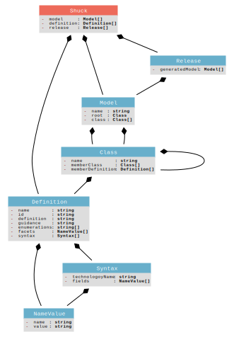

# shuck_meta_model

## Shuck

 This is a doccomment (note the double asterix)
 This comment is used to add documentation to your model,
 and will be added to the output generation if the technology
 you're deploying to supports it
 
 Doccomments apply to whatever is immediately beneath them
 
 The first line of a class definition can't start with a space
 just like Shuck here.

#### model: [Model](#model)[]

#### definition: [Definition](#definition)[]

#### release: [Release](#release)[]

## Model

#### name: string

#### root: [Class](#root)

#### class: [Class](#class)[]

## Class

#### name: string

#### memberClass: [Class](#memberclass)[]

#### memberDefinition: [Definition](#memberdefinition)[]

## Definition

#### name: string

#### id: string

#### definition: string

#### guidance: string

#### enumerations: string[]

#### facets: [NameValue](#facets)[]

#### syntax: [Syntax](#syntax)[]

## NameValue

#### name: string

#### value: string

## Syntax

#### technologoyName: string

#### fields: [NameValue](#fields)[]

## Release

#### generatedModel: [Model](#generatedmodel)[]

